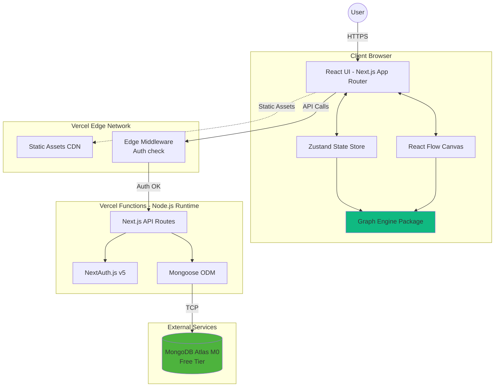

# Reasoning Graph - Architecture Full-Stack

**Version:** 1.0  
**Date:** 15 janvier 2026  
**Auteur:** Winston (Architect)

---

## 1. Introduction

Ce document décrit l'architecture full-stack complète de **Reasoning Graph**, incluant les systèmes backend, l'implémentation frontend et leur intégration. Il constitue la source unique de vérité pour le développement assisté par IA, garantissant la cohérence sur l'ensemble de la stack technologique.

Cette approche unifiée combine ce qui serait traditionnellement des documents d'architecture backend et frontend séparés, rationalisant le processus de développement pour les applications full-stack modernes où ces préoccupations sont de plus en plus imbriquées.

### Starter Template ou Projet Existant

**Statut:** Projet greenfield - Pas de template starter spécifié

**Décision:** Architecture pure Next.js 14 avec App Router + MongoDB pour flexibilité maximale avec le rendu graphique et l'évolution des schémas MongoDB à mesure que le système logique mature.

**Justification:** Next.js est explicitement spécifié dans le PRD avec MongoDB Atlas pour la flexibilité des schémas, essentielle pour l'évolution du système de propositions logiques. Pas de starter template pour éviter les contraintes framework et optimiser l'intégration React Flow.

### Change Log

| Date       | Version | Description           | Auteur  |
| ---------- | ------- | --------------------- | ------- |
| 2026-01-15 | 1.0     | Architecture initiale | Winston |

---

## 2. High Level Architecture

### Technical Summary

**Reasoning Graph** adopte une architecture **full-stack Next.js moderne** avec déploiement serverless sur Vercel. L'application utilise **Next.js 14+ avec App Router** pour le frontend React et les API Routes pour le backend, créant ainsi un monolithe élégant où frontend et backend partagent le même runtime Node.js et les mêmes types TypeScript. Le moteur de graphe logique, développé en TypeScript dans un package monorepo dédié, exploite **React Flow 11+** pour le rendu visuel des DAG (Directed Acyclic Graphs) et **graphlib** pour la validation topologique. L'état du graphe côté client est géré par **Zustand** pour des performances optimales lors de manipulations complexes de centaines de nodes. Le backend MongoDB Atlas (free tier) stocke les graphes persistants via **Mongoose**, tandis que **NextAuth.js v5** gère l'authentification JWT. Cette architecture serverless offre un excellent équilibre entre simplicité de développement (monorepo TypeScript unifié), scalabilité automatique (fonctions Vercel), et coût minimal (tiers gratuits), tout en permettant une validation logique en temps réel côté client et une collaboration future via partage de graphes publics.

### Platform and Infrastructure Choice

**Plateforme:** Vercel  
**Services Clés:** Vercel Edge Network (CDN), Vercel Functions (API Routes), MongoDB Atlas M0  
**Déploiement et Régions:** Région primaire US-East (Vercel) + MongoDB Atlas US-East-1 (minimiser latence inter-services)

**Justification:** Vercel est conçu pour Next.js, offrant le meilleur DX et temps de déploiement. MongoDB Atlas est explicitement requis dans le PRD pour flexibilité des schémas. Combinaison parfaite pour itération rapide et coûts nuls en MVP.

### Repository Structure

**Structure:** Monorepo (npm workspaces)  
**Outil Monorepo:** npm workspaces natif  
**Organisation des Packages:**

```
reasoning-graph/
├── apps/
│   └── web/                    # Next.js 14 App (frontend + API routes)
├── packages/
│   ├── graph-engine/           # ⭐ Cœur: validation logique, DAG algorithms
│   ├── ui-components/          # Composants React réutilisables
│   └── types/                  # Types TypeScript partagés
```

### High Level Architecture Diagram



### Architectural Patterns

- **Jamstack Architecture avec SSR Hybride:** Pages statiques pré-rendues + SSR pour pages nécessitant auth + CSR pour interactions canvas - _Rationale:_ Optimise performance tout en permettant édition temps réel fluide

- **Monolithic Full-Stack (Next.js as BFF):** Frontend et backend dans même application Next.js, API Routes servant de Backend-for-Frontend - _Rationale:_ Simplifie déploiement, partage types TypeScript, réduit latence réseau

- **Component-Based UI avec Atomic Design:** Composants React organisés en atomes, molécules, organismes - _Rationale:_ Réutilisabilité et testabilité

- **Repository Pattern pour Data Access:** Couche d'abstraction Mongoose isolant logique métier des détails MongoDB - _Rationale:_ Facilite tests et migration DB future

- **CQRS Léger:** Séparation read/write avec validation Zod différente - _Rationale:_ Optimisations ciblées

- **Client-Side Validation Engine:** Validation logique complète côté client avec Web Workers pour graphes >100 nodes - _Rationale:_ Feedback <100ms, réduit charge serveur

- **Serverless Functions Architecture:** API Routes déployées comme fonctions serverless auto-scaling - _Rationale:_ Coût nul au repos, scaling automatique

---

## 3. Tech Stack

Cette table constitue la source unique de vérité - tout développement doit utiliser exactement ces versions.

| Catégorie                | Technologie        | Version             | Objectif                     | Justification                                      |
| ------------------------ | ------------------ | ------------------- | ---------------------------- | -------------------------------------------------- |
| **Frontend Language**    | TypeScript         | 5.3+                | Langage principal frontend   | Type safety cruciale pour graph engine complexe    |
| **Frontend Framework**   | Next.js            | 14.1+               | Framework React full-stack   | App Router avec RSC, API Routes intégrées          |
| **UI Component Library** | React              | 18.2+               | Bibliothèque UI              | Standard industrie, React Flow compatible          |
| **Graph Rendering**      | React Flow         | 11.10+              | Canvas de graphe interactif  | Solution mature pour DAG editing                   |
| **State Management**     | Zustand            | 4.5+                | Store global léger           | Minimal boilerplate, excellent pour state complexe |
| **UI Component Library** | shadcn/ui          | Latest              | Composants UI réutilisables  | Components Tailwind copiables, Radix UI accessible |
| **CSS Framework**        | Tailwind CSS       | 3.4+                | Styling utility-first        | Rapid prototyping, design system via config        |
| **Backend Language**     | TypeScript         | 5.3+                | Langage API Routes           | Partage types avec frontend                        |
| **Backend Framework**    | Next.js API Routes | 14.1+               | Endpoints REST serverless    | Pas de serveur séparé, déploiement unifié          |
| **API Style**            | REST               | -                   | Architecture API             | Simplicité, caching HTTP standard                  |
| **Database**             | MongoDB            | 7.0+                | Base de données NoSQL        | Free tier Atlas, schémas flexibles                 |
| **ORM/ODM**              | Mongoose           | 8.1+                | Object Document Mapper       | Validation schemas, TypeScript support             |
| **Cache**                | Vercel KV (Redis)  | Latest              | Cache in-memory serverless   | Free tier 256MB, ultra-rapide                      |
| **File Storage**         | Vercel Blob        | Latest              | Stockage fichiers (future)   | Free tier 5GB, prêt pour export PNG/PDF            |
| **Authentication**       | NextAuth.js        | 5.0+ (beta)         | Auth avec JWT                | Provider credentials, session JWT                  |
| **Validation**           | Zod                | 3.22+               | Runtime validation           | Infer TypeScript types, schemas réutilisables      |
| **Frontend Testing**     | Jest               | 29.7+               | Unit tests composants React  | Standard industrie, React Testing Library          |
| **Backend Testing**      | Jest               | 29.7+               | Unit tests API Routes        | Même runner que frontend                           |
| **E2E Testing**          | Playwright         | 1.41+               | Tests end-to-end             | Multi-browser, debug UI excellent                  |
| **Build Tool**           | Turbopack          | Built-in Next.js 14 | Build et dev server          | Rust-powered ultra rapide                          |
| **Bundler**              | Turbopack          | Built-in Next.js 14 | Bundling production          | Tree-shaking optimal                               |
| **Graph Algorithms**     | graphlib           | 2.1+                | DAG validation et topo sort  | Détection cycles O(n)                              |
| **Layout Engine**        | @dagrejs/dagre     | 1.1+                | Auto-arrangement graphe      | Algorithme Sugiyama layout                         |
| **IaC Tool**             | Vercel CLI         | Latest              | Infrastructure as Code       | Configuration vercel.json                          |
| **CI/CD**                | GitHub Actions     | N/A                 | Pipeline CI/CD               | Free pour repos publics                            |
| **Monitoring**           | Vercel Analytics   | Latest (free tier)  | Analytics et Core Web Vitals | Real User Monitoring                               |
| **Logging**              | Vercel Logs        | Latest              | Logs serverless functions    | Tail logs en temps réel                            |
| **Error Tracking**       | Sentry             | Free tier           | Tracking erreurs production  | 5k events/mois gratuit                             |

---

## 4. Data Models

Les modèles de données constituent l'épine dorsale de Reasoning Graph, partagés entre frontend (TypeScript interfaces) et backend (Mongoose schemas).

### User

**Objectif:** Représente un utilisateur authentifié du système.

**Attributs Clés:**

- `_id`: ObjectId - Identifiant unique MongoDB
- `email`: string - Email unique
- `name`: string - Nom d'affichage
- `passwordHash`: string - Mot de passe hashé (bcrypt)
- `createdAt`: Date
- `graphQuota`: number - Max graphes (default: 50)
- `preferences`: Object - Préférences UI

**TypeScript Interface:**

```typescript
export interface User {
  id: string
  email: string
  name: string
  createdAt: Date
  graphQuota: number
  preferences: {
    theme: "light" | "dark"
    connectionMode: "drag-drop" | "click-click"
  }
}
```

**Relations:** Un User possède plusieurs ReasoningGraphs (one-to-many)

### ReasoningGraph

**Objectif:** Représente un graphe de raisonnement complet.

**Attributs Clés:**

- `_id`: ObjectId
- `title`: string
- `description`: string
- `ownerId`: ObjectId (ref User)
- `isPublic`: boolean (default: true)
- `nodes`: LogicNode[] (embedded)
- `edges`: Edge[] (embedded)
- `clonedFrom`: { graphId, originalAuthor }
- `tags`: string[]
- `category`: string

**TypeScript Interface:**

```typescript
export interface ReasoningGraph {
  id: string
  title: string
  description?: string
  ownerId: string
  ownerName: string
  isPublic: boolean
  nodes: LogicNode[]
  edges: Edge[]
  createdAt: Date
  updatedAt: Date
  clonedFrom?: {
    graphId: string
    originalAuthor: string
  }
  tags: string[]
  category: string
  validationStatus: "valid" | "invalid" | "partial"
}
```

### LogicNode

**Objectif:** Nœud logique polymorphe avec discriminateur `type`.

**Types:** axiom, modus-ponens, modus-tollens, syllogism, disjunction, reductio-ad-absurdum, induction, simple-affirmation, free-form, container

**TypeScript Interface:**

```typescript
export type NodeType =
  | "axiom"
  | "modus-ponens"
  | "modus-tollens"
  | "syllogism"
  | "disjunction"
  | "reductio-ad-absurdum"
  | "induction"
  | "simple-affirmation"
  | "free-form"
  | "container"

export interface LogicNodeBase {
  id: string
  type: NodeType
  position: { x: number; y: number }
  annotation?: string
  validationState: {
    isValid: boolean
    errors: string[]
    affectedDescendants: string[]
  }
}

export type LogicNode =
  | AxiomNode
  | ModusPonensNode
  | ModusTollensNode
  | SyllogismNode
  | DisjunctionNode
  | ReductioAdAbsurdumNode
  | InductionNode
  | SimpleAffirmationNode
  | FreeFormNode
  | ContainerNode
```

### Proposition

**Objectif:** Proposition logique typée avec type formel.

**TypeScript Interface:**

```typescript
export type PropositionType =
  | "simple"
  | "implication"
  | "negation"
  | "disjunction"
  | "conjunction"
  | "universal"
  | "existential"

export interface Proposition {
  id: string
  content: string
  propType: PropositionType
  subPropositions?: {
    antecedent?: Proposition
    consequent?: Proposition
    left?: Proposition
    right?: Proposition
  }
}
```

### Edge

**Objectif:** Connexion dirigée entre nodes.

**TypeScript Interface:**

```typescript
export interface Edge {
  id: string
  sourceNodeId: string
  sourceOutputIndex: number
  targetNodeId: string
  targetInputIndex: number
  isValid: boolean
  validationError?: string
}
```

---

## 5. API Specification

L'API REST suit les principes RESTful avec endpoints organisés par ressource. Tous les endpoints sont des Next.js API Routes serverless.

### Endpoints Principaux

**Authentication:**

- `POST /api/auth/signup` - Créer compte
- `GET /api/auth/session` - Session actuelle

**Users:**

- `GET /api/users/me` - Profil utilisateur
- `PATCH /api/users/me` - Mettre à jour profil

**Graphs:**

- `GET /api/graphs` - Lister graphes (filtres: my-graphs, public)
- `POST /api/graphs` - Créer graphe
- `GET /api/graphs/:id` - Récupérer graphe
- `PATCH /api/graphs/:id` - Mettre à jour
- `DELETE /api/graphs/:id` - Supprimer
- `POST /api/graphs/:id/clone` - Cloner graphe public
- `POST /api/graphs/:id/validate` - Valider côté serveur

**Library:**

- `GET /api/library/featured` - Graphes mis en avant
- `GET /api/library/categories` - Liste catégories

**System:**

- `GET /api/health` - Health check

### Schémas de Données

Voir OpenAPI 3.0 specification complète dans la section précédente pour schemas détaillés (User, ReasoningGraph, LogicNode, Proposition, Edge).

### Authentification

JWT via NextAuth.js dans header `Authorization: Bearer <token>` ou session cookie.

### Rate Limiting

- Authentifiés: 100 req/min
- Publics: 20 req/min

---

## 6. Components

### Frontend - GraphCanvas

**Responsabilité:** Composant principal orchestrant l'éditeur de graphe visuel avec React Flow.

**Interfaces:**

- `GraphCanvasProps`: { graphId, initialGraph, onSave, readOnly }
- `useGraphStore()`: Hook Zustand

**Stack:** React 18, TypeScript, React Flow, Tailwind CSS

### Frontend - NodeRenderer

**Responsabilité:** Rendu visuel polymorphe de chaque LogicNode avec notation formelle.

**Stack:** React, TypeScript, Tailwind, Lucide Icons

### Frontend - GraphValidationEngine

**Responsabilité:** Package autonome exécutant validation logique côté client.

**Interfaces:**

- `validateGraph(graph): ValidationResult`
- `detectCycles(nodes, edges): string[][]`
- `validateNodeLogic(node): NodeValidationResult`
- `propagateInvalidity(invalidNodeIds, graph): string[]`

**Stack:** TypeScript, graphlib, Web Worker capable

### Frontend - StateManagement (Zustand)

**Responsabilité:** Store global gérant état graphe, undo/redo, sélection.

**Stack:** Zustand 4.5+, immer

### Frontend - AutoLayoutService

**Responsabilité:** Calcul layout optimal avec ordre topologique gauche→droite.

**Stack:** TypeScript, Dagre

### Backend - GraphRepository

**Responsabilité:** Data access layer pour ReasoningGraph (pattern Repository).

**Méthodes:**

- `findById(graphId, userId?)`
- `create(graph, ownerId)`
- `update(graphId, updates, userId)`
- `delete(graphId, userId)`
- `clone(sourceGraphId, newOwnerId)`
- `findPublic(filters, pagination)`

**Stack:** TypeScript, Mongoose

### Backend - UserRepository

**Responsabilité:** Data access pour User.

**Stack:** TypeScript, Mongoose, bcrypt

### Backend - ValidationService

**Responsabilité:** Validation côté serveur (sécurité).

**Stack:** TypeScript, graph-engine package

### Backend - AuthMiddleware

**Responsabilité:** JWT verification et protection routes.

**Stack:** NextAuth.js 5, jose

### Backend - CacheService

**Responsabilité:** Cache Redis pour graphes publics.

**Stack:** Vercel KV (Redis)

---

## 7. Core Workflows

### Workflow 1: Création et Sauvegarde d'un Graphe

User crée nodes → validation temps réel côté client → sauvegarde → validation serveur → stockage MongoDB

### Workflow 2: Détection de Cycle en Temps Réel

User connecte nodes → détection cycle avec graphlib → si cycle: rejet, sinon: validation type → propagation erreurs

### Workflow 3: Navigation Container Fractal

User double-clic container → chargement sous-graphe (cache Redis ou MongoDB) → affichage breadcrumb → navigation retour

### Workflow 4: Clone/Fork Graphe Public

User browse bibliothèque → clic "Clone" → deep copy avec nouveaux IDs → traçabilité originalAuthor → redirect éditeur

### Workflow 5: Auto-Layout Topologique

User clic "Auto-Arrange" → topological sort → Dagre layout gauche→droite → animation smooth vers nouvelles positions

### Workflow 6: Détection Contradiction Axiomes

User crée axiomes contradictoires (P et ¬P) → validation détecte contradiction → marque invalide → warning banner

---

## 8. Database Schema

### User Schema (Mongoose)

```typescript
const UserSchema = new Schema({
  email: { type: String, required: true, unique: true },
  name: { type: String, required: true },
  passwordHash: { type: String, required: true, select: false },
  createdAt: { type: Date, default: Date.now },
  graphQuota: { type: Number, default: 50 },
  preferences: {
    theme: { type: String, enum: ["light", "dark"], default: "light" },
    connectionMode: { type: String, enum: ["drag-drop", "click-click"] },
  },
})

UserSchema.index({ email: 1 }, { unique: true })
```

### ReasoningGraph Schema (Mongoose)

```typescript
const ReasoningGraphSchema = new Schema(
  {
    title: { type: String, required: true, maxlength: 100 },
    description: { type: String, maxlength: 500 },
    ownerId: { type: Schema.Types.ObjectId, ref: "User", required: true },
    ownerName: { type: String, required: true },
    isPublic: { type: Boolean, default: true },
    nodes: {
      type: [LogicNodeSchema],
      validate: { validator: (nodes) => nodes.length <= 200 },
    },
    edges: [EdgeSchema],
    clonedFrom: ClonedFromSchema,
    tags: [String],
    category: String,
  },
  { timestamps: true }
)

// Indexes
ReasoningGraphSchema.index({ ownerId: 1, createdAt: -1 })
ReasoningGraphSchema.index({ isPublic: 1, category: 1, createdAt: -1 })
ReasoningGraphSchema.index({ isPublic: 1, tags: 1 })
ReasoningGraphSchema.index({ title: "text", description: "text" })
```

### Database Indexes Summary

| Collection | Index                           | Type     | Purpose             |
| ---------- | ------------------------------- | -------- | ------------------- |
| users      | email                           | Unique   | Login lookup        |
| graphs     | ownerId                         | Standard | "My graphs" queries |
| graphs     | isPublic                        | Standard | Public filtering    |
| graphs     | {isPublic, category, createdAt} | Compound | Library browsing    |
| graphs     | {title, description}            | Text     | Full-text search    |

### MongoDB Atlas Configuration

- **Cluster:** M0 Free Tier (512MB)
- **Region:** AWS US-East-1
- **Database:** reasoning-graph
- **Estimated Storage:** ~60 MB pour MVP (452 MB margin)

---

## 9. Frontend Architecture

### Component Organization

```
apps/web/
├── app/                    # Next.js App Router
│   ├── (auth)/
│   ├── (dashboard)/
│   └── api/
├── components/
│   ├── editor/
│   ├── library/
│   ├── ui/                # shadcn/ui
│   └── shared/
├── hooks/
├── stores/                # Zustand stores
├── services/              # API clients
└── lib/                   # Utilities
```

### State Management (Zustand)

**Store Structure:**

```typescript
interface GraphStore {
  currentGraph: ReasoningGraph | null
  history: HistoryState
  selectedNodeIds: string[]
  editorMode: "select" | "connect" | "pan"
  breadcrumb: string[]

  // Actions
  addNode(node): void
  updateNode(id, updates): void
  deleteNode(id): void
  undo(): void
  redo(): void
  validateCurrentGraph(): void
}
```

**Pattern: Selective Subscriptions**

```typescript
const nodes = useGraphStore((state) => state.currentGraph?.nodes)
```

### Routing Architecture

**Routes:**

- `(auth)/login` - Page login
- `(auth)/signup` - Page signup
- `(dashboard)/editor` - Éditeur graphe (protected)
- `(dashboard)/library` - Bibliothèque publique
- `(dashboard)/my-graphs` - Mes graphes (protected)

**Protection:** Next.js middleware vérifie JWT avant render

### Frontend Services

**API Client:**

```typescript
class ApiClient {
  async get<T>(endpoint): Promise<T>
  async post<T>(endpoint, data): Promise<T>
  async patch<T>(endpoint, data): Promise<T>
  async delete(endpoint): Promise<void>
}
```

**GraphService:**

```typescript
export const graphService = {
  getMyGraphs(params),
  getPublicGraphs(params),
  getGraphById(id),
  createGraph(data),
  updateGraph(id, updates),
  cloneGraph(id),
  validateGraph(id),
};
```

---

## 10. Backend Architecture

### API Route Organization

```
apps/web/app/api/
├── auth/
│   └── [...nextauth]/route.ts
├── graphs/
│   ├── route.ts              # GET/POST
│   └── [id]/
│       ├── route.ts          # GET/PATCH/DELETE
│       ├── clone/route.ts
│       └── validate/route.ts
├── users/me/route.ts
├── library/
│   ├── featured/route.ts
│   └── categories/route.ts
└── health/route.ts
```

### Repository Pattern

**GraphRepository:**

```typescript
export class GraphRepository {
  static async findById(graphId, userId?)
  static async findByOwner(userId, options)
  static async findPublic(filters, options)
  static async create(data, ownerId, ownerName)
  static async update(graphId, updates, userId)
  static async delete(graphId, userId)
  static async clone(sourceGraphId, newOwnerId, newOwnerName)
  static async countByOwner(userId)
}
```

**UserRepository:**

```typescript
export class UserRepository {
  static async findByEmail(email)
  static async findById(userId)
  static async create(data)
  static async verifyPassword(email, password)
  static async updatePreferences(userId, preferences)
}
```

### Authentication (NextAuth.js)

```typescript
export const authOptions: NextAuthOptions = {
  providers: [
    CredentialsProvider({
      async authorize(credentials) {
        const user = await UserRepository.verifyPassword(
          credentials.email,
          credentials.password
        )
        return user
      },
    }),
  ],
  session: { strategy: "jwt", maxAge: 7 * 24 * 60 * 60 },
  secret: process.env.NEXTAUTH_SECRET,
}
```

**Auth Middleware:**

```typescript
export function withAuth(handler: AuthenticatedHandler) {
  return async (request, context) => {
    const token = await getToken({ req: request })
    if (!token) {
      return NextResponse.json({ error: "Unauthorized" }, { status: 401 })
    }
    return handler(request, { ...context, user: token })
  }
}
```

### Caching (Vercel KV)

```typescript
export class CacheService {
  static async getCached<T>(key): Promise<T | null>
  static async setCached<T>(key, value, ttl): Promise<void>
  static async invalidate(key): Promise<void>
}
```

**Cache Strategy:**

- Graphes publics: TTL 5min
- Library featured: TTL 1h
- Graceful degradation si Redis down

---

## 11. Unified Project Structure

```
reasoning-graph/
├── .github/workflows/        # CI/CD
├── apps/
│   └── web/                  # Next.js App
│       ├── app/              # App Router (pages + API)
│       ├── components/
│       ├── lib/
│       ├── repositories/
│       ├── models/
│       ├── services/
│       ├── stores/
│       ├── hooks/
│       └── package.json
├── packages/
│   ├── graph-engine/         # Validation logique
│   │   ├── src/
│   │   │   ├── nodes/
│   │   │   ├── propositions/
│   │   │   ├── validation/
│   │   │   └── layout/
│   │   └── package.json
│   ├── ui-components/        # Composants React
│   └── types/                # Types partagés
├── scripts/
├── docs/
├── package.json              # Root workspace
└── README.md
```

---

## 12. Development Workflow

### Local Setup

```bash
# Installation
npm install

# Configuration
cp .env.example .env.local
# Éditer .env.local avec MongoDB URI et secrets

# Démarrage
npm run dev                  # Dev server (port 3000)
npm test                     # Tests
npm run lint                 # Linting
npm run type-check           # TypeScript
npm run build                # Build production
```

### Environment Variables

```bash
# .env.local
MONGODB_URI=mongodb+srv://...
NEXTAUTH_URL=http://localhost:3000
NEXTAUTH_SECRET=<secret>
KV_URL=<vercel-kv-url>
NODE_ENV=development
```

---

## 13. Deployment Architecture

### Deployment Strategy

**Frontend:** Vercel (auto-deploy sur push)  
**Backend:** Vercel Functions (serverless)  
**Database:** MongoDB Atlas M0  
**Cache:** Vercel KV (Redis)

### CI/CD Pipeline

```yaml
# .github/workflows/ci.yml
name: CI
on: [push, pull_request]
jobs:
  test:
    runs-on: ubuntu-latest
    steps:
      - uses: actions/checkout@v4
      - uses: actions/setup-node@v4
      - run: npm ci
      - run: npm run lint
      - run: npm run type-check
      - run: npm run test:coverage
      - run: npm run build
```

### Environments

| Environment | URL                        | Branch     | Purpose    |
| ----------- | -------------------------- | ---------- | ---------- |
| Development | localhost:3000             | -          | Local dev  |
| Preview     | `*.vercel.app`             | feature/\* | PR testing |
| Production  | reasoning-graph.vercel.app | main       | Live       |

---

## 14. Security and Performance

### Security

**Frontend:**

- CSP Headers
- XSS Prevention (React escaping)
- Secure Storage (httpOnly cookies)

**Backend:**

- Input Validation (Zod)
- Rate Limiting (100 req/min)
- CORS Policy (whitelist)

**Authentication:**

- JWT httpOnly cookies
- Session 7 jours
- Bcrypt password hash (10 rounds)

### Performance

**Frontend:**

- Bundle target: <300KB gzipped
- React lazy() pour code splitting
- Zustand selective subscriptions
- React.memo sur NodeRenderer

**Backend:**

- Response time: P95 <500ms
- MongoDB indexes sur queries fréquentes
- Connection pooling (2-10 connexions)
- Redis cache (graphes publics 5min TTL)

**Monitoring:**

- Vercel Analytics (Core Web Vitals)
- Sentry (error tracking, 5k events/mois)
- Vercel Logs (tail en temps réel)

---

## 11. Development Guidelines

### Code Documentation Standards

**JSDoc for Public APIs:**

- All exported functions, classes, and interfaces MUST have JSDoc comments
- Include @param, @returns, @throws, @example when applicable
- Example:

```typescript
/**
 * Validates a logic node and its connections
 * @param node - The logic node to validate
 * @param edges - All edges in the graph
 * @returns Validation result with errors if any
 * @throws ValidationError if node structure is invalid
 */
export function validateNode(node: LogicNode, edges: Edge[]): ValidationResult
```

**Inline Comments for Complex Logic:**

- Graph engine algorithms MUST have step-by-step comments
- Validation rules MUST explain the logic being validated
- Performance-critical sections MUST document optimization rationale

**Naming Conventions:**

- Components: PascalCase (e.g., `NodeRenderer`, `GraphCanvas`)
- Functions/variables: camelCase (e.g., `validateGraph`, `isConnecting`)
- Constants: UPPER_SNAKE_CASE (e.g., `MAX_NODES`, `DEFAULT_ZOOM`)
- Types/Interfaces: PascalCase with descriptive names (e.g., `ValidationResult`, `PropositionType`)
- File names: kebab-case for components (e.g., `node-renderer.tsx`), camelCase for utilities

**TypeScript Standards:**

- Strict mode enabled (no any, implicit any, null checks)
- Prefer interfaces over types for object shapes
- Use discriminated unions for polymorphic data (e.g., LogicNode)
- Export types alongside implementation

### Error Message Guidelines

**Structure:** Problem + Cause + Solution

**Tone:** Helpful and non-blaming

**Examples:**

- ❌ Bad: "Invalid connection"
- ✅ Good: "Cannot connect: Modus Ponens requires an implication (P→Q) as first premise. Try connecting an implication node instead."

**Categories:**

- Validation errors: Explain logic rule violated
- Network errors: Suggest retry or check connection
- User input errors: Guide toward correct format

### Form Validation Patterns

**Client-Side:**

- Use Zod schemas for all forms
- Real-time validation on blur (not on every keystroke)
- Display errors below field with red text and icon
- Disable submit button if form invalid

**Server-Side:**

- ALWAYS revalidate with same Zod schemas
- Return structured error responses: `{ field: string, message: string }[]`
- Log validation failures for security monitoring

### Testing Standards

**Unit Tests (80%+ coverage for graph-engine):**

- Test files colocated: `node-validator.ts` → `node-validator.test.ts`
- Use descriptive test names: `describe("validateModusPonens") { it("should fail when first premise is not an implication") }`
- Mock external dependencies (MongoDB, APIs)
- Use MongoDB Memory Server for database tests

**Integration Tests:**

- Test API endpoints with supertest
- Test critical user flows end-to-end
- Use test database (not production!)

**E2E Tests (Playwright):**

- Focus on critical paths: auth, create graph, save graph, load graph
- Run in CI pipeline on every PR
- Use data-testid attributes for stable selectors

### Git Workflow

**Branches:**

- main: production-ready code
- develop: integration branch (optional for larger teams)
- feature/story-X-Y: feature branches (e.g., feature/story-2-1-propositions)

**Commits:**

- Conventional commits: `feat:`, `fix:`, `docs:`, `test:`, `refactor:`
- Reference story: `feat(story-3.2): implement validation engine`
- Keep commits atomic and focused

**Pull Requests:**

- Title: `Story X.Y: Brief description`
- Description: Link to story, summary of changes, testing done
- Require 1 approval before merge
- CI must pass (tests, linting, build)

---

## Conclusion

Cette architecture full-stack Next.js avec MongoDB offre:

✅ **Simplicité:** Monorepo TypeScript unifié, un seul déploiement  
✅ **Performance:** Validation client temps réel, cache Redis, serverless auto-scaling  
✅ **Coût:** Tiers gratuits (Vercel, MongoDB Atlas M0, Vercel KV)  
✅ **Scalabilité:** Architecture serverless, horizontal scaling automatique  
✅ **Maintenabilité:** Repository pattern, types partagés, tests 80%+ coverage  
✅ **Sécurité:** Double validation (client+serveur), JWT, rate limiting

Prêt pour développement MVP avec path clair vers features Phase 2 (collaboration temps réel, mobile, exports).

---

**Document généré par Winston (Architect) - 15 janvier 2026**
