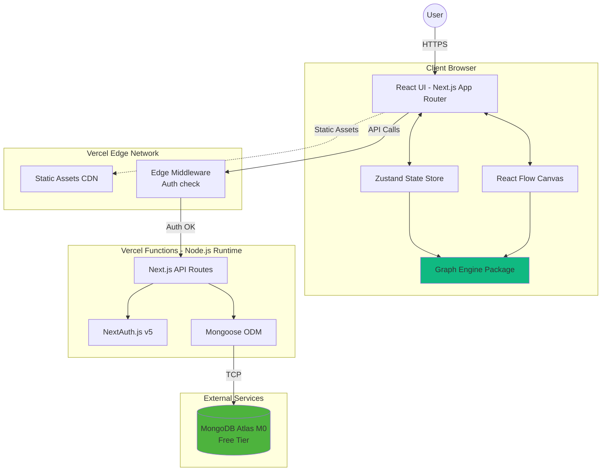

# Reasoning Graph - Architecture Full-Stack

**Version:** 1.2 (Sharded)  
**Date:** 23 janvier 2026  
**Auteur:** Winston (Architect)

---

## 1. Introduction

Ce document décrit l'architecture full-stack complète de **Reasoning Graph**, incluant les systèmes backend, l'implémentation frontend et leur intégration. Il constitue la source unique de vérité pour le développement assisté par IA, garantissant la cohérence sur l'ensemble de la stack technologique.

Cette approche unifiée combine ce qui serait traditionnellement des documents d'architecture backend et frontend séparés, rationalisant le processus de développement pour les applications full-stack modernes où ces préoccupations sont de plus en plus imbriquées.

**📁 Architecture Shardée:**

Ce document est maintenant organisé en modules pour une meilleure maintenabilité et performance des agents IA. Les sections détaillées sont disponibles dans `/docs/architecture/`.

**Documentation Complémentaire:**

- **[Front-End UX Specification](front-end-spec.md)** (v1.0, 23 janvier 2026) - Spécifications détaillées des composants UI, interactions utilisateur, et guidelines de design visuel. **Ce document complète** l'architecture avec les spécifications frontend. Pour l'architecture backend et full-stack, référer à ce document.
- **[PRD](prd.md)** (v4) - Product Requirements Document définissant les fonctionnalités et objectifs métier
- **[Stories](stories/)** - User stories détaillées pour l'implémentation itérative (36 stories sur 7 epics)

### Starter Template ou Projet Existant

**Statut:** Projet greenfield - Pas de template starter spécifié

**Décision:** Architecture pure Next.js 14 avec App Router + MongoDB pour flexibilité maximale avec le rendu graphique et l'évolution des schémas MongoDB à mesure que le système logique mature.

**Justification:** Next.js est explicitement spécifié dans le PRD avec MongoDB Atlas pour la flexibilité des schémas, essentielle pour l'évolution du système de propositions logiques. Pas de starter template pour éviter les contraintes framework et optimiser l'intégration React Flow.

### Change Log

| Date       | Version | Description                                                                                                                                    | Auteur  |
| ---------- | ------- | ---------------------------------------------------------------------------------------------------------------------------------------------- | ------- |
| 2026-01-15 | 1.0     | Architecture initiale                                                                                                                          | Winston |
| 2026-01-23 | 1.1     | Ajout section 9.5: Frontend UI Component Architecture avec spécifications UX complètes (composants, design system, accessibilité, performance) | Winston |
| 2026-01-23 | 1.2     | Migration vers architecture shardée pour optimiser performance agents IA (<800 lignes par document)                                            | Winston |

---

## 2. High Level Architecture

### Technical Summary

**Reasoning Graph** adopte une architecture **full-stack Next.js moderne** avec déploiement serverless sur Vercel. L'application utilise **Next.js 14+ avec App Router** pour le frontend React et les API Routes pour le backend, créant ainsi un monolithe élégant où frontend et backend partagent le même runtime Node.js et les mêmes types TypeScript. Le moteur de graphe logique, développé en TypeScript dans un package monorepo dédié, exploite **React Flow 11+** pour le rendu visuel des DAG (Directed Acyclic Graphs) et **graphlib** pour la validation topologique. L'état du graphe côté client est géré par **Zustand** pour des performances optimales lors de manipulations complexes de centaines de nodes. Le backend MongoDB Atlas (free tier) stocke les graphes persistants via **Mongoose**, tandis que **NextAuth.js v5** gère l'authentification JWT. Cette architecture serverless offre un excellent équilibre entre simplicité de développement (monorepo TypeScript unifié), scalabilité automatique (fonctions Vercel), et coût minimal (tiers gratuits), tout en permettant une validation logique en temps réel côté client et une collaboration future via partage de graphes publics.

### Platform and Infrastructure Choice

**Plateforme:** Vercel  
**Services Clés:** Vercel Edge Network (CDN), Vercel Functions (API Routes), MongoDB Atlas M0  
**Déploiement et Régions:** Région primaire US-East (Vercel) + MongoDB Atlas US-East-1 (minimiser latence inter-services)

**Justification:** Vercel est conçu pour Next.js, offrant le meilleur DX et temps de déploiement. MongoDB Atlas est explicitement requis dans le PRD pour flexibilité des schémas. Combinaison parfaite pour itération rapide et coûts nuls en MVP.

### High Level Architecture Diagram



### Architectural Patterns

- **Jamstack Architecture avec SSR Hybride:** Pages statiques pré-rendues + SSR pour pages nécessitant auth + CSR pour interactions canvas - _Rationale:_ Optimise performance tout en permettant édition temps réel fluide

- **Monolithic Full-Stack (Next.js as BFF):** Frontend et backend dans même application Next.js, API Routes servant de Backend-for-Frontend - _Rationale:_ Simplifie déploiement, partage types TypeScript, réduit latence réseau

- **Component-Based UI avec Atomic Design:** Composants React organisés en atomes, molécules, organismes - _Rationale:_ Réutilisabilité et testabilité

- **Repository Pattern pour Data Access:** Couche d'abstraction Mongoose isolant logique métier des détails MongoDB - _Rationale:_ Facilite tests et migration DB future

- **CQRS Léger:** Séparation read/write avec validation Zod différente - _Rationale:_ Optimisations ciblées

- **Client-Side Validation Engine:** Validation logique complète côté client avec Web Workers pour graphes >100 nodes - _Rationale:_ Feedback <100ms, réduit charge serveur

- **Serverless Functions Architecture:** API Routes déployées comme fonctions serverless auto-scaling - _Rationale:_ Coût nul au repos, scaling automatique

---

## 3. Tech Stack

**📄 Voir: [architecture/tech-stack.md](architecture/tech-stack.md)**

Stack technologique détaillé avec versions spécifiques, justifications et objectifs pour chaque technologie (frontend, backend, testing, monitoring).

**Résumé Clé:**

- **Frontend:** Next.js 14+, React 18, TypeScript 5.3+, React Flow 11+, Zustand, Tailwind CSS
- **Backend:** Next.js API Routes, MongoDB 7+, Mongoose, NextAuth.js v5
- **Testing:** Jest, Playwright, React Testing Library
- **Infrastructure:** Vercel (serverless), MongoDB Atlas M0, Vercel KV (Redis)

---

## 4. Project Structure

**📄 Voir: [architecture/source-tree.md](architecture/source-tree.md)**

Organisation complète du monorepo avec npm workspaces, structure des packages (graph-engine, ui-components, types) et architecture de dossiers Next.js.

**Résumé:**

```
reasoning-graph/
├── apps/web/           # Next.js App (frontend + API)
├── packages/
│   ├── graph-engine/   # ⭐ Validation logique
│   ├── ui-components/  # Composants React
│   └── types/          # Types partagés
└── docs/               # Documentation
```

---

## 5. Data Models

Les modèles de données constituent l'épine dorsale de Reasoning Graph, partagés entre frontend (TypeScript interfaces) et backend (Mongoose schemas).

### User

**Objectif:** Représente un utilisateur authentifié du système.

**TypeScript Interface:**

```typescript
export interface User {
  id: string;
  email: string;
  name: string;
  createdAt: Date;
  graphQuota: number;
  preferences: {
    theme: 'light' | 'dark';
    connectionMode: 'drag-drop' | 'click-click';
  };
}
```

**Relations:** Un User possède plusieurs ReasoningGraphs (one-to-many)

### ReasoningGraph

**Objectif:** Représente un graphe de raisonnement complet.

**TypeScript Interface:**

```typescript
export interface ReasoningGraph {
  id: string;
  title: string;
  description?: string;
  ownerId: string;
  ownerName: string;
  isPublic: boolean;
  nodes: LogicNode[];
  edges: Edge[];
  createdAt: Date;
  updatedAt: Date;
  clonedFrom?: {
    graphId: string;
    originalAuthor: string;
  };
  tags: string[];
  category: string;
  validationStatus: 'valid' | 'invalid' | 'partial';
}
```

### LogicNode

**Objectif:** Nœud logique polymorphe avec discriminateur `type`.

**Types:** axiom, modus-ponens, modus-tollens, syllogism, disjunction, reductio-ad-absurdum, induction, simple-affirmation, free-form, container

**TypeScript Interface:**

```typescript
export type NodeType =
  | 'axiom'
  | 'modus-ponens'
  | 'modus-tollens'
  | 'syllogism'
  | 'disjunction'
  | 'reductio-ad-absurdum'
  | 'induction'
  | 'simple-affirmation'
  | 'free-form'
  | 'container';

export interface LogicNodeBase {
  id: string;
  type: NodeType;
  position: { x: number; y: number };
  annotation?: string;
  validationState: {
    isValid: boolean;
    errors: string[];
    affectedDescendants: string[];
  };
}
```

### Proposition

**Objectif:** Proposition logique typée avec type formel.

```typescript
export type PropositionType =
  | 'simple'
  | 'implication'
  | 'negation'
  | 'disjunction'
  | 'conjunction'
  | 'universal'
  | 'existential';

export interface Proposition {
  id: string;
  content: string;
  propType: PropositionType;
  subPropositions?: {
    antecedent?: Proposition;
    consequent?: Proposition;
    left?: Proposition;
    right?: Proposition;
  };
}
```

### Edge

**Objectif:** Connexion dirigée entre nodes.

```typescript
export interface Edge {
  id: string;
  sourceNodeId: string;
  sourceOutputIndex: number;
  targetNodeId: string;
  targetInputIndex: number;
  isValid: boolean;
  validationError?: string;
}
```

---

## 6. API Specification

L'API REST suit les principes RESTful avec endpoints organisés par ressource. Tous les endpoints sont des Next.js API Routes serverless.

### Endpoints Principaux

**Authentication:**

- `POST /api/auth/signup` - Créer compte
- `GET /api/auth/session` - Session actuelle

**Users:**

- `GET /api/users/me` - Profil utilisateur
- `PATCH /api/users/me` - Mettre à jour profil

**Graphs:**

- `GET /api/graphs` - Lister graphes (filtres: my-graphs, public)
- `POST /api/graphs` - Créer graphe
- `GET /api/graphs/:id` - Récupérer graphe
- `PATCH /api/graphs/:id` - Mettre à jour
- `DELETE /api/graphs/:id` - Supprimer
- `POST /api/graphs/:id/clone` - Cloner graphe public
- `POST /api/graphs/:id/validate` - Valider côté serveur

**Library:**

- `GET /api/library/featured` - Graphes mis en avant
- `GET /api/library/categories` - Liste catégories

**System:**

- `GET /api/health` - Health check

### Authentification

JWT via NextAuth.js dans header `Authorization: Bearer <token>` ou session cookie.

### Rate Limiting

- Authentifiés: 100 req/min
- Publics: 20 req/min

---

## 7. Development Guidelines

**📄 Voir: [architecture/coding-standards.md](architecture/coding-standards.md)**

Standards de code complets incluant conventions de nommage, JSDoc, patterns de validation, stratégie de tests, et workflow Git.

**Résumé Clé:**

- **TypeScript Strict Mode:** No `any`, discriminated unions pour LogicNode
- **Testing:** 80%+ coverage sur graph-engine, Jest + Playwright
- **Commits:** Conventional commits avec référence story
- **PR:** Require 1 approval, CI must pass

---

## 8. Frontend Architecture

### Component Organization

```
apps/web/
├── app/                    # Next.js App Router
│   ├── (auth)/
│   ├── (dashboard)/
│   └── api/
├── components/
│   ├── editor/
│   ├── library/
│   ├── ui/                # shadcn/ui
│   └── shared/
├── hooks/
├── stores/                # Zustand stores
├── services/              # API clients
└── lib/                   # Utilities
```

### State Management (Zustand)

**Store Structure:**

```typescript
interface GraphStore {
  currentGraph: ReasoningGraph | null;
  history: HistoryState;
  selectedNodeIds: string[];
  editorMode: 'select' | 'connect' | 'pan';
  breadcrumb: string[];

  // Actions
  addNode(node): void;
  updateNode(id, updates): void;
  deleteNode(id): void;
  undo(): void;
  redo(): void;
  validateCurrentGraph(): void;
}
```

### Routing Architecture

**Routes:**

- `(auth)/login` - Page login
- `(auth)/signup` - Page signup
- `(dashboard)/editor` - Éditeur graphe (protected)
- `(dashboard)/library` - Bibliothèque publique
- `(dashboard)/my-graphs` - Mes graphes (protected)

**Protection:** Next.js middleware vérifie JWT avant render

### Core Workflows

**Workflow 1: Création et Sauvegarde d'un Graphe**

User crée nodes → validation temps réel côté client → sauvegarde → validation serveur → stockage MongoDB

**Workflow 2: Détection de Cycle en Temps Réel**

User connecte nodes → détection cycle avec graphlib → si cycle: rejet, sinon: validation type → propagation erreurs

**Workflow 3: Auto-Layout Topologique**

User clic "Auto-Arrange" → topological sort → Dagre layout gauche→droite → animation smooth vers nouvelles positions

---

## 9. Frontend UI Components Architecture

**📋 Note:** Cette section définit l'architecture détaillée des composants visuels pour les nodes logiques, basée sur la [Front-End UX Specification](front-end-spec.md) v1.0.

### Component Hierarchy

```
components/editor/
├── GraphCanvas.tsx              # Orchestrateur React Flow
├── logic-nodes/
│   ├── LogicNodeBase.tsx        # ⭐ Composant base réutilisable
│   ├── AxiomNode.tsx
│   ├── ModusPonensNode.tsx
│   └── ... (9 types de nodes)
├── propositions/
│   ├── PropositionDisplay.tsx   # ⭐ Affichage/édition
│   └── PropositionEditor.tsx
├── NodeTypeMenu.tsx             # ⭐ Menu contextuel
├── NodeValidationIndicator.tsx  # ⭐ Badge validation
└── ConnectionLine.tsx
```

### Core Component: LogicNodeBase

**Dimensions Standards:**

- Width: **280px** (fixe)
- Min height: 100px
- Border: 2px (3px si selected)
- Padding: 12px
- Handle: 12px diameter

**Visual States:**

- Default: Border `neutral-300`
- Valid: Border `green-500`
- Invalid: Border `red-500` + badge erreur
- Warning: Border `amber-500` (FreeForm)
- Selected: Border `blue-600` épaisse

**Props Interface:**

```typescript
interface LogicNodeBaseProps {
  id: string;
  type: NodeType;
  label: string;
  notation: string;
  icon: React.ReactNode;
  premises: PropositionDisplayData[];
  conclusions: PropositionDisplayData[];
  validationState: NodeValidationState;
  selected: boolean;
  onPropositionEdit: (propId: string, content: string) => void;
}
```

### Design System Integration

**Color Palette (Tailwind):**

- Primary: `blue-600` (#2563EB) - Selection, focus
- Success: `green-500` (#10B981) - Valid connections
- Warning: `amber-500` (#F59E0B) - FreeForm nodes
- Error: `red-500` (#EF4444) - Invalid connections

**Typography:**

- Node Label: 14px, font-semibold
- Notation: 12px, font-medium
- Proposition: 14px, font-normal

**Icon Mapping:**

- Axiom: 🔷 (foundational - blue)
- Modus Ponens: 🔶 (inference - orange)
- Reductio ad Absurdum: 🔺 (advanced - purple)
- Free Form: ⚠️ (special - yellow)

### Accessibility (WCAG 2.1 AA)

- **Color Contrast:** 4.5:1 minimum
- **Focus Indicators:** 2px outline blue
- **Keyboard Navigation:** Tab, Enter, Escape, Delete
- **Screen Reader:** ARIA labels sur tous les handles
- **Touch Targets:** 44x44px minimum

### Performance Targets

- **Node Render:** < 16ms per node (60 FPS)
- **Interaction Response:** < 100ms
- **Canvas Pan/Zoom:** 30+ FPS avec 200 nodes
- **Validation:** < 50ms per connection

**Optimization Strategies:**

- React.memo sur tous les nodes
- Zustand selective subscriptions
- React Flow viewport culling
- GPU-accelerated animations (transform, opacity only)

---

## 10. Backend Architecture

### API Route Organization

```
apps/web/app/api/
├── auth/
│   └── [...nextauth]/route.ts
├── graphs/
│   ├── route.ts              # GET/POST
│   └── [id]/
│       ├── route.ts          # GET/PATCH/DELETE
│       ├── clone/route.ts
│       └── validate/route.ts
├── users/me/route.ts
├── library/
│   ├── featured/route.ts
│   └── categories/route.ts
└── health/route.ts
```

### Repository Pattern

**GraphRepository:**

```typescript
export class GraphRepository {
  static async findById(graphId, userId?);
  static async findByOwner(userId, options);
  static async findPublic(filters, options);
  static async create(data, ownerId, ownerName);
  static async update(graphId, updates, userId);
  static async delete(graphId, userId);
  static async clone(sourceGraphId, newOwnerId, newOwnerName);
}
```

### Authentication (NextAuth.js)

```typescript
export const authOptions: NextAuthOptions = {
  providers: [CredentialsProvider({...})],
  session: { strategy: 'jwt', maxAge: 7 * 24 * 60 * 60 },
  secret: process.env.NEXTAUTH_SECRET,
};
```

### Database Schema

**MongoDB Collections:**

- `users`: User accounts
- `graphs`: ReasoningGraph documents (embedded nodes + edges)

**Key Indexes:**

- users.email (unique)
- graphs.ownerId + createdAt
- graphs.isPublic + category + createdAt
- graphs (title, description) - text search

**MongoDB Atlas Configuration:**

- **Cluster:** M0 Free Tier (512MB)
- **Region:** AWS US-East-1
- **Estimated Storage:** ~60 MB pour MVP

### Caching Strategy

**Vercel KV (Redis):**

- Graphes publics: TTL 5min
- Library featured: TTL 1h
- Graceful degradation si Redis down

---

## 11. Deployment & Security

### Deployment Strategy

**Frontend:** Vercel (auto-deploy sur push)  
**Backend:** Vercel Functions (serverless)  
**Database:** MongoDB Atlas M0  
**Cache:** Vercel KV (Redis)

### CI/CD Pipeline

```yaml
# .github/workflows/ci.yml
name: CI
on: [push, pull_request]
jobs:
  test:
    runs-on: ubuntu-latest
    steps:
      - uses: actions/checkout@v4
      - run: npm ci
      - run: npm run lint
      - run: npm run type-check
      - run: npm run test:coverage
      - run: npm run build
```

### Environments

| Environment | URL                        | Branch     | Purpose    |
| ----------- | -------------------------- | ---------- | ---------- |
| Development | localhost:3000             | -          | Local dev  |
| Preview     | `*.vercel.app`             | feature/\* | PR testing |
| Production  | reasoning-graph.vercel.app | main       | Live       |

### Security

**Frontend:**

- CSP Headers
- XSS Prevention (React escaping)
- Secure Storage (httpOnly cookies)

**Backend:**

- Input Validation (Zod)
- Rate Limiting (100 req/min authenticated, 20 req/min public)
- CORS Policy (whitelist)

**Authentication:**

- JWT httpOnly cookies
- Session 7 jours
- Bcrypt password hash (10 rounds)

### Performance

**Frontend:**

- Bundle target: <300KB gzipped
- React lazy() pour code splitting
- Zustand selective subscriptions

**Backend:**

- Response time: P95 <500ms
- MongoDB indexes sur queries fréquentes
- Connection pooling (2-10 connexions)

**Monitoring:**

- Vercel Analytics (Core Web Vitals)
- Sentry (error tracking, 5k events/mois)
- Vercel Logs (tail en temps réel)

---

## Conclusion

Cette architecture full-stack Next.js avec MongoDB offre:

✅ **Simplicité:** Monorepo TypeScript unifié, un seul déploiement  
✅ **Performance:** Validation client temps réel, cache Redis, serverless auto-scaling  
✅ **Coût:** Tiers gratuits (Vercel, MongoDB Atlas M0, Vercel KV)  
✅ **Scalabilité:** Architecture serverless, horizontal scaling automatique  
✅ **Maintenabilité:** Repository pattern, types partagés, tests 80%+ coverage  
✅ **Sécurité:** Double validation (client+serveur), JWT, rate limiting

**Architecture Shardée:** Document master optimisé (<800 lignes) avec sections détaillées disponibles dans `/docs/architecture/` pour performance optimale des agents IA.

Prêt pour développement MVP avec path clair vers features Phase 2 (collaboration temps réel, mobile, exports).

---

**Document généré par Winston (Architect) - 23 janvier 2026**
