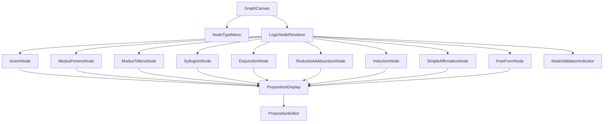
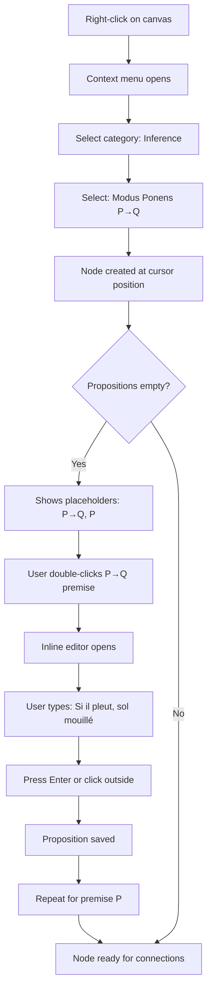
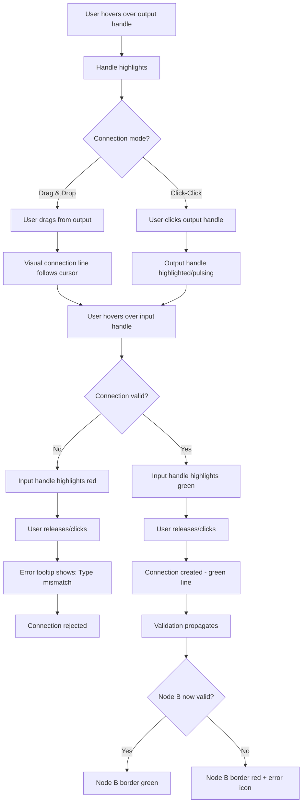

# Logic Nodes UI/UX Specification - Reasoning Graph

**Version:** 1.0  
**Date:** January 23, 2026  
**Author:** Sally (UX Expert)

---

## Introduction

Cette spécification définit l'expérience utilisateur, l'architecture d'information, et les spécifications de design visuel pour les **composants de nodes logiques** dans l'éditeur de graphes de raisonnement. Elle sert de fondation pour le développement frontend et assure une expérience cohérente et centrée sur l'utilisateur.

**Ce document complète** [architecture.md](architecture.md) avec les spécifications frontend détaillées. Pour l'architecture backend et full-stack, référer à architecture.md et ses sous-documents dans [architecture/](architecture/).

**Contexte:** Le projet a complété l'implémentation backend des nodes logiques (Story 2.1-2.4) avec 9 types de nodes différents. Les Stories 2.5-2.7 implémentent les composants visuels définis dans ce document. Cette spec comble le gap UI en définissant comment visualiser et interagir avec chaque type de node logique.

---

## Overall UX Goals & Principles

### Target User Personas

**Researcher / Logic Enthusiast**

- Construit des raisonnements formels complexes (100+ nodes)
- Comprend la notation logique de base (P→Q, ¬P, etc.)
- Priorité: Rigueur formelle + efficacité de workflow
- Sensible aux erreurs logiques non détectées

**Student / Learner**

- Apprend la logique formelle et la construction d'arguments
- Besoin de feedback visuel clair et explicatif
- Priorité: Clarté, guidage, accessibilité

**Professional / Analyst**

- Documente et valide des raisonnements pour des décisions critiques
- Besoin de traçabilité et de réutilisabilité
- Priorité: Fiabilité, sauvegarde, partage

### Usability Goals

1. **Ease of Learning:** Utilisateurs comprennent la différence entre types de nodes et peuvent créer leur premier raisonnement en < 10 minutes
2. **Efficiency of Use:** Power users créent et connectent des nodes en < 3 secondes par node
3. **Error Prevention:** Feedback visuel immédiat empêche les connexions logiques invalides avant leur création
4. **Cognitive Load:** Design uniforme réduit la charge mentale malgré la complexité des 9 types de nodes
5. **Visual Clarity:** État de validation visible instantanément même sur graphes de 200+ nodes

### Design Principles

1. **Notation Formelle d'Abord** - Utiliser les symboles logiques standards (P→Q, ¬P) pour une reconnaissance immédiate par les utilisateurs formés
2. **Validation Non-Bloquante** - Guider visuellement sans empêcher l'exploration créative
3. **Alignement Spatial = Flux Logique** - Entrées à gauche, sorties à droite reflète naturellement la causalité
4. **Uniformité Malgré la Diversité** - Tous les nodes partagent la même structure visuelle de base pour réduire la complexité perçue
5. **Progressive Disclosure** - Afficher les détails uniquement quand nécessaire (placeholders → contenu réel)

### Change Log

| Date       | Version | Description                           | Author            |
| ---------- | ------- | ------------------------------------- | ----------------- |
| 2026-01-23 | 1.0     | Spécification initiale Logic Nodes UI | Sally (UX Expert) |

---

## Information Architecture (IA)

### Component Hierarchy



### Navigation Structure

**Primary Interaction:** Clic droit sur canvas → Menu de sélection de type de node → Node créé

**Secondary Navigation:**

- Double-clic sur proposition → Mode édition inline
- Hover sur node invalide → Tooltip explicatif
- Sélection de node → Border highlight

**State Management:**

- Zustand store maintient l'état de tous les nodes
- React Flow gère le canvas et le positionnement
- Validation state propagé depuis graph-engine

---

## User Flows

### Flow 1: Create and Configure a Logic Node

**User Goal:** Créer un node Modus Ponens et remplir ses propositions

**Entry Points:** Clic droit n'importe où sur le canvas

**Success Criteria:** Node créé avec propositions valides et connecté au graphe

#### Flow Diagram



#### Edge Cases & Error Handling

- **User clicks outside menu:** Menu closes, no node created
- **User creates node but leaves propositions empty:** Node shows placeholders, border neutral (not invalid yet)
- **User edits proposition while connected:** Connection breaks automatically, visual feedback shows disconnection
- **Canvas is zoomed:** Menu and node scale appropriately
- **User tries to type invalid logical notation:** No validation (free text allowed)

**Notes:** Le workflow privilégie la rapidité de création. Les propositions peuvent rester vides initialement, permettant une exploration fluide.

---

### Flow 2: Connect Two Nodes with Validation Feedback

**User Goal:** Connecter la conclusion d'un node A à la prémisse d'un node B

**Entry Points:** Drag handle de sortie OU click-click mode

**Success Criteria:** Connexion créée et validée (ou erreur affichée clairement)

#### Flow Diagram



#### Edge Cases & Error Handling

- **Cyclic connection detected:** Connection rejected, tooltip: "Would create circular reasoning"
- **Proposition types incompatible:** Connection rejected, tooltip: "Expected P→Q, got simple P"
- **User cancels mid-drag:** Press Escape, connection line disappears
- **Multiple outputs connected to same input:** Allowed (multiple premises can reference same proposition)
- **User tries input→output or output→output:** Cursor shows "not-allowed", no connection possible

**Notes:** La validation se fait en temps réel pendant le drag, permettant un feedback immédiat avant même de créer la connexion.

---

## Component Library / Design System

### Design System Approach

**Hybrid Approach:** Utiliser Tailwind CSS comme base + composants custom pour les nodes logiques. Pas besoin d'un design system externe complet (Shadcn/Radix) pour MVP, mais considérer pour évolution future.

**Rationale:** Tailwind fournit utilités de base (spacing, colors, typography). Les nodes logiques nécessitent des composants très spécifiques qui justifient une implémentation custom.

---

### Core Components

#### Component 1: LogicNodeBase

**Purpose:** Composant de base réutilisable pour tous les types de nodes logiques, fournissant la structure visuelle uniforme.

**Variants:**

- Standard (validé)
- Invalid (erreur logique)
- Warning (FreeForm permanent warning)
- Selected (border highlight)
- Disabled (read-only mode)

**States:**

- Default: Border gris neutre
- Valid: Border vert subtil
- Invalid: Border rouge
- Warning: Border orange
- Hover: Shadow légèrement augmentée
- Focus: Outline bleu accessibilité
- Selected: Border bleu épais

**Visual Structure:**

```
┌─────────────────────────────────────┐
│ HEADER ZONE                         │ ← Icon + Label + Notation
├─────────────────────────────────────┤
│ PREMISES ZONE                       │ ← Input propositions + handles
│ ○ Premise 1                         │
│ ○ Premise 2                         │
├─────────────────────────────────────┤
│ CONCLUSIONS ZONE                    │ ← Output propositions + handles
│ Conclusion 1                      ○ │
└─────────────────────────────────────┘
```

**Technical Props:**

```typescript
interface LogicNodeBaseProps {
  id: string;
  type: NodeType;
  label: string; // "Modus Ponens"
  notation: string; // "P → Q"
  icon: React.ReactNode; // Icône du type
  premises: PropositionDisplay[];
  conclusions: PropositionDisplay[];
  validationState: {
    isValid: boolean;
    status: 'valid' | 'invalid' | 'warning' | 'neutral';
    errors: string[];
  };
  selected: boolean;
  onPropositionEdit: (propId: string, newContent: string) => void;
}

interface PropositionDisplay {
  id: string;
  content: string; // Texte de la proposition
  placeholder: string; // Ex: "P → Q" si vide
  isEmpty: boolean;
  type: 'premise' | 'conclusion';
  position: number; // Pour ordering
}
```

**Usage Guidelines:**

- Tous les nodes logiques doivent hériter de ce composant
- Ne jamais modifier la structure de base (header/premises/conclusions)
- Variations uniquement via props et CSS classes

**Dimensions:**

- Width: 280px fixe (cohérence visuelle)
- Min height: 100px
- Max height: 400px (au-delà, scrollable ou erreur UX)
- Padding: 12px interne
- Border radius: 8px
- Border width: 2px (standard), 3px (selected)

**Spacing:**

- Header zone: 40px height
- Premise item: 32px height minimum
- Separator lines: 1px, color neutral-300
- Handle size: 12px diameter
- Handle offset: 8px from edge

---

#### Component 2: PropositionDisplay

**Purpose:** Affiche une proposition individuelle (prémisse ou conclusion) avec son handle de connexion aligné

**Variants:**

- Empty (placeholder visible)
- Filled (contenu affiché)
- Editing (mode édition inline)

**States:**

- Default: Texte noir sur fond blanc
- Empty: Texte grisé italique (placeholder)
- Hover: Background légèrement grisé
- Editing: Border bleu, background blanc, cursor text
- Invalid: Texte rouge si proposition causant erreur

**Visual Structure:**

```
Premise (input left):
○ "Si il pleut, le sol est mouillé" ← Texte wrappé si long
↑ Handle aligné verticalement avec le texte

Conclusion (output right):
"Le sol est mouillé"                  ○
                                       ↑ Handle à droite
```

**Technical Props:**

```typescript
interface PropositionDisplayProps {
  id: string;
  content: string;
  placeholder: string;
  isEmpty: boolean;
  type: 'premise' | 'conclusion';
  position: number;
  isEditing: boolean;
  onDoubleClick: () => void;
  onChange: (newContent: string) => void;
  onBlur: () => void;
  maxLength?: number; // Default 200 chars
}
```

**Usage Guidelines:**

- Double-clic pour entrer en mode édition
- Enter ou blur pour sauvegarder
- Escape pour annuler
- Text wrap automatique si > largeur node (280px - padding)
- Max 3 lignes de texte visible, ellipsis au-delà avec tooltip

**Typography:**

- Font: System sans-serif (inter, sans-serif)
- Size: 14px (body text)
- Line height: 1.5
- Placeholder: opacity 0.5, italic

---

#### Component 3: NodeTypeMenu

**Purpose:** Menu contextuel catégorisé pour sélectionner le type de node à créer

**Variants:**

- Compact (petites icônes)
- Expanded (avec descriptions)

**States:**

- Visible/Hidden
- Category expanded/collapsed
- Item hover
- Item selected

**Visual Structure:**

```
┌──────────────────────────────────┐
│ Create Logic Node                │
├──────────────────────────────────┤
│ ▼ FOUNDATIONAL                   │
│   🔷 Axiom                   [A] │
│   🔷 Simple Affirmation     [S] │
├──────────────────────────────────┤
│ ▼ INFERENCE                      │
│   🔶 Modus Ponens        [P → Q]│
│   🔶 Modus Tollens          [¬Q]│
│   🔶 Syllogism          [A→B→C] │
│   🔶 Disjunction          [P∨Q] │
├──────────────────────────────────┤
│ ▼ ADVANCED                       │
│   🔺 Reductio ad Absurdum  [P→⊥]│
│   🔺 Induction            [∀n P]│
├──────────────────────────────────┤
│ ▼ SPECIAL                        │
│   ⚠️  Free Form           [Custom]│
└──────────────────────────────────┘
```

**Technical Props:**

```typescript
interface NodeTypeMenuProps {
  position: { x: number; y: number };
  onSelect: (nodeType: NodeType) => void;
  onClose: () => void;
  visible: boolean;
}

interface MenuItem {
  type: NodeType;
  category: NodeCategory;
  label: string;
  notation: string;
  icon: string; // Emoji ou icon component
  description?: string;
}
```

**Usage Guidelines:**

- Apparaît au clic droit sur canvas
- Position suit le curseur
- Click outside pour fermer
- Hover sur item montre description dans tooltip
- Catégories collapsibles (accordéon)
- Recherche rapide par première lettre (keyboard navigation)

**Dimensions:**

- Width: 300px fixe
- Item height: 36px
- Max height: 500px (scrollable si nécessaire)
- Shadow: elevation-3 (8px blur)

---

#### Component 4: NodeValidationIndicator

**Purpose:** Indicateur visuel compact des erreurs de validation sur un node

**Variants:**

- Error (rouge)
- Warning (orange)
- Valid (vert discret ou pas d'indicateur)

**States:**

- Collapsed (icône uniquement)
- Expanded (tooltip avec détails)

**Visual Structure:**

```
Position: Top-right corner du node

Collapsed:
┌────────────────┐
│ 🔷 Node    [⚠️] │ ← Badge warning/error
└────────────────┘

Expanded (on hover):
┌────────────────────────────────┐
│ Validation Errors:             │
│ • Premise 1 missing            │
│ • Type mismatch on connection  │
│ • Cyclic dependency detected   │
└────────────────────────────────┘
```

**Technical Props:**

```typescript
interface NodeValidationIndicatorProps {
  status: 'valid' | 'invalid' | 'warning' | 'neutral';
  errors: string[];
  position: 'top-right' | 'top-left';
}
```

**Usage Guidelines:**

- Toujours visible si erreurs présentes
- Hover pour tooltip détaillé
- Click pour ouvrir panneau de debug (future feature)
- FreeForm node: toujours warning state (permanent)

**Icon Mapping:**

- Valid: ✓ (checkmark vert discret)
- Invalid: ⚠️ (triangle rouge)
- Warning: ⚠️ (triangle orange)
- Neutral: pas d'icône

---

## Branding & Style Guide

### Color Palette

| Color Type  | Hex Code               | Usage                             |
| ----------- | ---------------------- | --------------------------------- |
| Primary     | `#2563EB` (blue-600)   | Selection, focus, primary actions |
| Secondary   | `#64748B` (slate-500)  | Secondary text, borders           |
| Accent      | `#8B5CF6` (violet-600) | Highlights, special features      |
| Success     | `#10B981` (green-500)  | Valid connections, success states |
| Warning     | `#F59E0B` (amber-500)  | FreeForm nodes, cautions          |
| Error       | `#EF4444` (red-500)    | Invalid connections, errors       |
| Neutral-100 | `#F1F5F9`              | Background (light mode)           |
| Neutral-800 | `#1E293B`              | Background (dark mode)            |
| Neutral-300 | `#CBD5E1`              | Borders, dividers (light)         |
| Neutral-600 | `#475569`              | Borders, dividers (dark)          |

**Theme Adaptation:**

- Light mode: Background neutral-100, text neutral-900
- Dark mode: Background neutral-800, text neutral-100
- Node backgrounds: Always white (light) / neutral-900 (dark) pour contraste

### Typography

**Font Families:**

- Primary: `Inter, -apple-system, BlinkMacSystemFont, 'Segoe UI', sans-serif`
- Monospace: `'Fira Code', 'Courier New', monospace` (pour notation logique)

**Type Scale:**

| Element          | Size | Weight         | Line Height | Usage                  |
| ---------------- | ---- | -------------- | ----------- | ---------------------- |
| Node Label       | 14px | 600 (semibold) | 1.4         | Header labels          |
| Notation         | 12px | 500 (medium)   | 1.3         | Logical notation (P→Q) |
| Proposition Text | 14px | 400 (regular)  | 1.5         | Main content           |
| Placeholder      | 14px | 400 (regular)  | 1.5         | Empty state hints      |
| Tooltip          | 12px | 400 (regular)  | 1.4         | Error messages         |
| Menu Item        | 14px | 500 (medium)   | 1.4         | Context menu           |

### Iconography

**Icon Library:** Lucide React (déjà utilisé dans le projet)

**Icon Mapping by Node Type:**

| Node Type            | Icon | Lucide Component |
| -------------------- | ---- | ---------------- |
| Axiom                | 🔷   | `CircleDot`      |
| Simple Affirmation   | 🔷   | `MessageSquare`  |
| Modus Ponens         | 🔶   | `ArrowRight`     |
| Modus Tollens        | 🔶   | `ArrowLeftRight` |
| Syllogism            | 🔶   | `GitMerge`       |
| Disjunction          | 🔶   | `GitBranch`      |
| Reductio ad Absurdum | 🔺   | `AlertTriangle`  |
| Induction            | 🔺   | `Repeat`         |
| Free Form            | ⚠️   | `Edit3`          |

**Usage Guidelines:**

- Icon size: 16px dans le header
- Icon color: Matches category (foundational=blue, inference=orange, advanced=purple, special=yellow)
- Always accompagné du label textuel (pas d'icon-only nodes)

### Spacing & Layout

**Grid System:** Pas de grid strict sur le canvas (free-form positioning), mais nodes s'alignent sur grille 20px pour magnétisme

**Spacing Scale (Tailwind):**

- xs: 4px (0.5 Tailwind)
- sm: 8px (2 Tailwind)
- md: 12px (3 Tailwind)
- lg: 16px (4 Tailwind)
- xl: 24px (6 Tailwind)

**Node Internal Spacing:**

- Padding: 12px (md) sur tous les côtés
- Gap entre propositions: 8px (sm)
- Gap header-body: 0 (separator line)
- Gap body-footer: 0 (separator line)

---

## Accessibility Requirements

### Compliance Target

**Standard:** WCAG 2.1 AA (conformément au PRD)

### Key Requirements

**Visual:**

- Color contrast ratios: 4.5:1 minimum pour texte normal, 3:1 pour texte large (> 18px)
- Validation ne repose pas uniquement sur couleur (icon + border + tooltip)
- Focus indicators: 2px outline bleu, offset 2px
- Text sizing: Support zoom 200% sans perte fonctionnalité

**Interaction:**

- Keyboard navigation:
  - Tab: Navigue entre nodes
  - Enter: Sélectionne node / entre en mode édition
  - Escape: Ferme menu / annule édition
  - Delete/Backspace: Supprime node sélectionné
  - Arrow keys: Déplace node sélectionné (future)
- Screen reader support:
  - Aria-label sur handles: "Input premise 1" / "Output conclusion"
  - Aria-live pour validation errors (annonce changements)
  - Role="group" sur nodes avec label du type
- Touch targets: Handles minimum 44x44px (déjà 12px + padding reach 44px)

**Content:**

- Alternative text: Icônes ont aria-label descriptifs
- Heading structure: Pas de headings dans nodes (composants atomiques)
- Form labels: Propositions en édition ont label invisible pour screen readers

### Testing Strategy

1. **Automated:** Axe DevTools sur composants Storybook
2. **Manual keyboard:** Test complet workflow sans souris
3. **Screen reader:** NVDA (Windows) et VoiceOver (Mac) testing
4. **Color blindness:** Sim Daltonism pour vérifier distinction rouge/vert

---

## Responsiveness Strategy

**Note:** Selon le PRD (NFR3), l'application cible des écrans PC avec résolution minimum 1280x720. Responsive mobile n'est **pas prioritaire** pour MVP.

### Breakpoints

| Breakpoint | Min Width | Max Width | Target Devices | Adaptation                                                   |
| ---------- | --------- | --------- | -------------- | ------------------------------------------------------------ |
| Minimum    | 1280px    | -         | Desktop only   | Design principal                                             |
| Wide       | 1920px    | -         | Large monitors | Utiliser espace supplémentaire pour panneau latéral (future) |

### Adaptation Patterns

**Layout Changes:**

- < 1280px: Warning message "Veuillez utiliser un écran plus large pour une expérience optimale"
- \> 1920px: Canvas centered, max-width 1600px content zone

**Navigation Changes:** N/A (pas de mobile navigation)

**Content Priority:** Tout le contenu est essentiel, pas de hiding

**Interaction Changes:** Toujours souris + clavier (pas de touch gestures)

---

## Animation & Micro-interactions

### Motion Principles

1. **Purposeful Motion:** Animations servent à guider l'attention, pas à décorer
2. **Performance First:** 60 FPS minimum, utiliser transform/opacity (GPU-accelerated)
3. **Respect Reduced Motion:** Respecter prefers-reduced-motion (disable animations)
4. **Consistent Timing:** Utiliser courbes d'easing cohérentes

### Key Animations

- **Menu Appear:** Fade in + slight scale (0.95 → 1.0), Duration: 150ms, Easing: ease-out
- **Node Creation:** Pop in effect (scale 0.8 → 1.0), Duration: 200ms, Easing: cubic-bezier(0.34, 1.56, 0.64, 1) (slight bounce)
- **Connection Line:** Smooth bezier curve drawing, Duration: 300ms, Easing: ease-in-out
- **Validation State Change:** Color transition on border, Duration: 200ms, Easing: ease
- **Handle Hover:** Scale 1.0 → 1.3, Duration: 100ms, Easing: ease-out
- **Proposition Edit Focus:** Border color fade, Duration: 150ms, Easing: ease
- **Error Shake:** Subtle horizontal shake on invalid connection attempt, Duration: 400ms, Easing: ease-in-out
- **Node Selection:** Border width 2px → 3px, Duration: 100ms, Easing: ease

---

## Performance Considerations

### Performance Goals

- **Node Render:** < 16ms per node (60 FPS)
- **Interaction Response:** < 100ms (conforme NFR2)
- **Canvas Pan/Zoom:** 30+ FPS avec 200 nodes (conforme NFR1)
- **Connection Validation:** < 50ms per connection check

### Design Strategies

1. **Virtualization:** React Flow gère déjà le viewport culling (render only visible nodes)
2. **Memoization:** Tous les composants de nodes sont `React.memo`
3. **Lazy Loading:** Icônes chargées via dynamic import
4. **Debouncing:** Validation propagation debounced à 100ms
5. **Optimized Re-renders:** Zustand selective subscriptions (ne re-render que les nodes affectés)
6. **SVG Optimization:** Handles sont CSS circles (pas SVG complexes)

**Design Decisions for Performance:**

- Fixed node width (280px) → prévisible layout, pas de reflow
- Max 3 lines proposition text → bounds hauteur node
- Simple border effects (no shadows on every node) → moins de GPU load
- Static icon components (pas d'animations icon permanentes)

---

## Next Steps

### Immediate Actions

1. **Créer les 4 stories UX** (2.5, 2.6, 2.7, 3.6) basées sur cette spec
2. **Valider avec Product Manager** que la vision UX aligne avec le PRD
3. **Créer Storybook stories** pour chaque composant (LogicNodeBase, PropositionDisplay, NodeTypeMenu, NodeValidationIndicator)
4. **Designer les icônes manquantes** ou confirmer mapping Lucide icons
5. **Prototyper un node type** (ex: ModusPonens) en isolation avant de créer les 9 types

### Design Handoff Checklist

- [x] All user flows documented (Create node, Connect nodes)
- [x] Component inventory complete (4 core components définis)
- [x] Accessibility requirements defined (WCAG 2.1 AA)
- [x] Responsive strategy clear (Desktop-only, 1280px min)
- [x] Brand guidelines incorporated (Tailwind colors, Inter font)
- [x] Performance goals established (< 100ms interactions, 60 FPS)
- [ ] Visual mockups in Figma (À créer ou générer avec v0/Lovable)
- [ ] Icon assets exported (Lucide icons selection confirmée)
- [ ] Component prop interfaces validated with dev team
- [ ] Accessibility testing plan scheduled

### Open Questions / Decisions Needed

1. **Icon Library:** Confirmer si émojis (🔷🔶🔺⚠️) ou Lucide icons? Émojis plus rapides mais moins cohérents cross-platform.
2. **Proposition Max Length:** 200 caractères suffisant ou augmenter à 500?
3. **Storybook:** Mettre en place avant ou après Story 2.5?
4. **Complex Propositions:** Comment éditer une ImplicationProposition (P→Q) avec ses sub-props? Modal ou inline nested?
5. **Drag & Drop vs Click-Click:** Implémenter les deux modes ou juste drag & drop pour MVP?

---

## Appendix: Complete Node Type Specifications

### Node Type Detailed Specs

| Type                 | Label                 | Notation | Icon | Premises              | Conclusions   | Category     | Notes                               |
| -------------------- | --------------------- | -------- | ---- | --------------------- | ------------- | ------------ | ----------------------------------- |
| Axiom                | Axiome                | [A]      | 🔷   | 0                     | 1             | Foundational | Base propositions, toujours valides |
| Simple Affirmation   | Affirmation Simple    | [P]      | 🔷   | 0                     | 1             | Foundational | Déclaration simple                  |
| Modus Ponens         | Modus Ponens          | [P → Q]  | 🔶   | 2 (P→Q, P)            | 1 (Q)         | Inference    | Classique                           |
| Modus Tollens        | Modus Tollens         | [¬Q]     | 🔶   | 2 (P→Q, ¬Q)           | 1 (¬P)        | Inference    | Contraposée                         |
| Syllogism            | Syllogisme            | [A→B→C]  | 🔶   | 2 (major, minor)      | 1             | Inference    | Transitivité                        |
| Disjunction          | Disjonction           | [P∨Q]    | 🔶   | 2 (P∨Q, ¬P)           | 1 (Q)         | Inference    | Élimination                         |
| Reductio ad Absurdum | Réduction à l'Absurde | [P→⊥]    | 🔺   | 1 (P→⊥)               | 1 (¬P)        | Advanced     | Preuve par contradiction            |
| Induction            | Induction             | [∀n P]   | 🔺   | 2 (P(0), P(n)→P(n+1)) | 1 (∀n P(n))   | Advanced     | Mathématique                        |
| Free Form            | Forme Libre           | [Custom] | ⚠️   | 0-5 (dynamic)         | 1-3 (dynamic) | Special      | Non validé, toujours warning        |

---

**Fin de la spécification v1.0**
